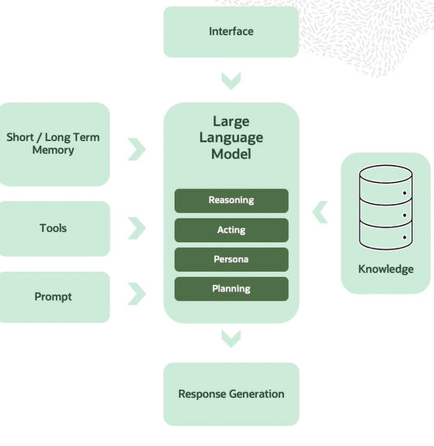

## Interface

This is the point where the user interacts with the AI agent. It can be a chatbot, a web app, a voice interface, or any application where the user inputs a query or a command. The system feeds various inputs to large language model.

## Short/Long Term Memory
It can provide context from past interactions, enabling continuity and relevance in conversations.

## Tools
different external tools, for example, different APIs, databases, or third-party systems to enhance the model's capabilities.

## Prompt
It contains the specific query or task provided by the user guiding the AI on how to generate responses. And at the heart of the system.

# Large language model (LLM)
It basically performs four key operations, reasoning, acting, persona, and planning. 
- Reasoning, it analyzes the input to generate logical and coherent responses. 
- Acting, it determines actions based on the task, for example, whether it's about querying databases or calling different APIs. 
- Persona is maintaining a consistent tone, style, and behavior aligned with the brand or use case. 
- planning, that is strategically organizing responses or actions, especially in multi-step workflows.

## Knowledge
The LLM can also access external knowledge bases, such as databases or document repositories, to enrich its responses with accurate and up-to-date information. You have already seen a use case of RAG. This allows the agent to go beyond just its internal training data.

